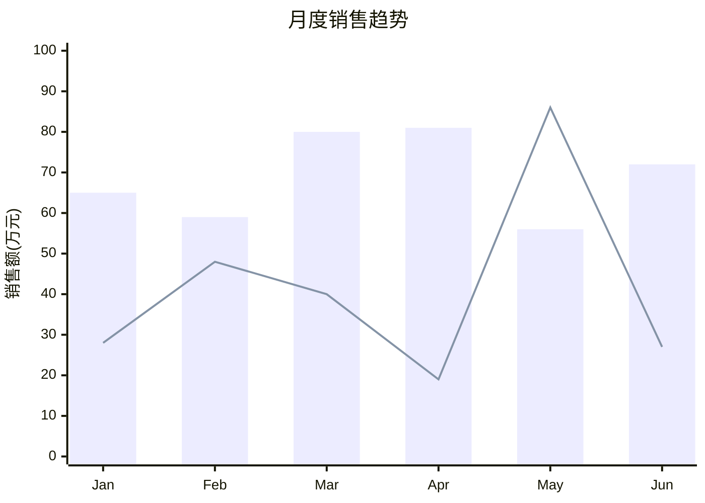
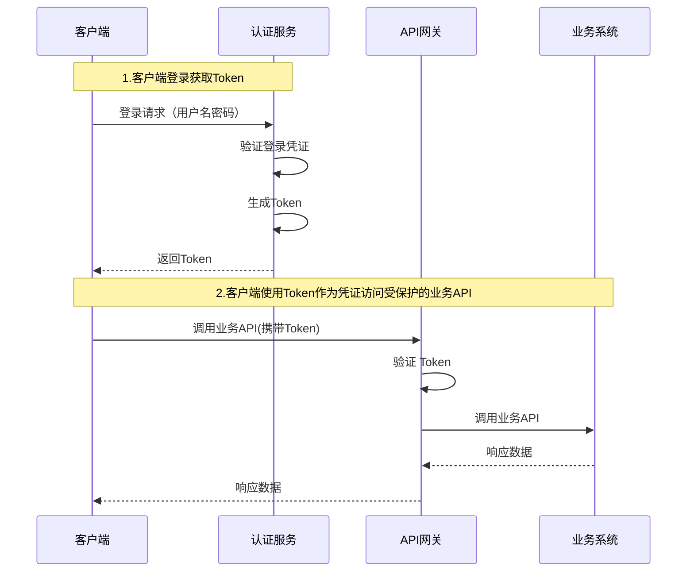

# 欢迎使用 Tools.Top 的 Markdown 编辑器

这是一个功能强大的在线 Markdown 编辑器，支持实时预览、语法高亮和丰富的格式化功能。

## 🎯 支持LaTex公式输入

- **Markdown编辑器 - LaTeX 数学公式支持** 🎓
  - **完整 LaTeX 渲染**：支持行内公式和块级公式
  - **公式 PNG 导出**：每个块级公式右上角提供 PNG 导出按钮，支持暗色/亮色/护眼主题背景
  - **HTML 导出增强**：智能检测 LaTeX 公式，自动内联 KaTeX CSS 和字体（Base64），生成完全独立的 HTML
  - **PDF导出**：支持LaTeX公式导出到PDF
  - **丰富的数学符号**：支持分数、根式、求和、积分、矩阵等常用数学表达式


## 🎯 支持VIM编辑模式
  - **完整 Vim 快捷键**：支持 Normal、Insert、Visual 等 Vim 模式和快捷键
  - **状态持久化**：Vim 模式偏好保存到本地，刷新页面后自动恢复


## 🎯 全新升级的图表功能

我们已升级到最新版Mermaid，支持12种图表类型，包括2种全新图表：

### XY图表 - 数据可视化利器 🆕


### 象限图 - 优先级分析神器 🆕


### 经典图表类型
我们同时支持所有经典图表：流程图、时序图、甘特图、类图、状态图、饼图、用户旅程图、Git图、思维导图、时间轴。

## 📝 使用指南

1. **工具栏操作**：点击"图表"按钮，选择需要的图表类型
2. **快速插入**：选择图表类型后，系统会自动插入模板代码
3. **自定义编辑**：根据需要修改模板中的数据和标签
4. **实时预览**：编辑器右侧会实时显示图表渲染效果
5. **导出功能**：支持导出为PNG、SVG等格式

## 🚀 功能特色

- ✅ **12种图表类型**：包含2种全新图表类型（XY图表、象限图）
- ✅ **最新Mermaid引擎**：使用最新版本，支持更多功能
- ✅ **实时预览**：所见即所得的编辑体验
- ✅ **语法高亮**：支持多种编程语言的代码高亮
- ✅ **主题切换**：支持暗色/亮色主题
- ✅ **导出功能**：支持HTML、Markdown、PDF导出
- ✅ **自动保存**：防止数据丢失
- ✅ **响应式设计**：完美适配各种设备

开始您的Markdown创作之旅吧！🎉

---

## JWT 深度解析

深入理解 JSON Web Token 的工作原理、安全机制和最佳实践。

## 一个生动的比喻
想象一下，你有一张会员卡（JWT），可以进入一家高级俱乐部（受保护的资源/API）。

#### 颁发（登录）
你向俱乐部的前台（认证服务器）出示你的身份证（用户名和密码）。前台验证通过后，为你制作一张特殊的会员卡（JWT）。这张卡上有你的基本信息（姓名、会员等级），并且有俱乐部经理的防伪签名（数字签名）。

#### 使用（访问API）：
你拿着这张会员卡想去酒吧区（API接口）点一杯酒。保安（API服务器）不需要打电话问前台你是谁。他只需要：

- 检查卡片样式，确认是本公司发行的（验证 iss 发行者）
- 用俱乐部专用的验钞灯（公钥）照射卡片上的防伪签名，确认签名是真的（验证签名）
- 看一眼卡片上的会员等级，确认你有权限进入酒吧区（验证权限/角色）
- 看一眼卡片的有效期（exp），确认卡片没有过期

> 核心要点：保安（API服务器）自己就能验证这张卡的有效性，而不需要每次都与前台（认证服务器）数据库联机查询。这就是 JWT 的核心优势：无状态（Stateless） 和可分布式验证。

## JWT 是什么？
JWT（JSON Web Token） 是一个开放标准（RFC 7519），它定义了一种紧凑且自包含的方式，用于在各方之间作为 JSON 对象安全地传输信息。

紧凑（Compact）：因为它很小，可以通过 URL、POST 参数或者 HTTP 请求头（Authorization）轻松发送
自包含（Self-contained）：Payload（负载）中包含了所有用户需要的信息，避免了多次查询数据库
一个 JWT 看起来是这样的（由三部分组成，用点.分隔）：
```
xxxxx.yyyyy.zzzzz
```
实际例子：
```
Header: eyJhbGciOiJIUzI1NiIsInR5cCI6IkpXVCJ9
Payload: eyJzdWIiOiIxMjM0NTY3ODkwIiwibmFtZSI6IkpvaG4gRG9lIiwiaWF0IjoxNTE2MjM5MDIyfQ
Signature: SflKxwRJSMeKKF2QT4fwpMeJf36POk6yJV_adQssw5c
```


**JWT 由三部分组成，分别是 Header（头部）、Payload（负载） 和 Signature（签名）。**

### 1. Header（头部）

通常由两部分组成：令牌的类型（即 "JWT"）和所使用的签名算法（如 HMAC SHA256 或 RSA）。
```json
{ "alg": "HS256", "typ": "JWT" }
```
这个 JSON 对象会被 Base64Url 编码形成 JWT 的第一部分。

### 2. Payload（负载）

负载包含了所谓的 声明（Claims）。声明是关于实体（通常是用户）和其他数据的陈述。

```json
{ "sub": "1234567890", "name": "John Doe", "admin": true, "iat": 1516239022 }
```

> 重要提示
Payload 只是经过编码，并没有加密。任何人拿到 JWT 都可以解码出其中的信息。因此，绝对不要在 Payload 中存放敏感信息（如密码）。

声明（Claims）的三种类型
1. 注册声明（Registered claims）：预定义的一组声明，如 iss（签发者）、exp（过期时间）、sub（主题）等
2. 公共声明（Public claims）：可以随意定义，但应避免冲突
3. 私有声明（Private claims）：在同意使用它们的各方之间共享信息的自定义声明

### 3. Signature（签名）
这是 JWT 最核心、最安全的部分。签名用于验证消息在整个过程中没有被篡改。

下面是对称方式生成签名的公式：
```
HMACSHA256( base64UrlEncode(header) + "." + base64UrlEncode(payload), secret )
```
通常，我们会使用更安全的非对称加密算法（如 RS256），而不是对称加密（HS256）来颁发JWT。这就引入了公钥（Public Key） 和私钥（Private Key） 的概念。

- 文本私钥（Private Key）：由 Token 的颁发者（认证服务器）严格保密，绝不能泄露。它用于生成签名（Sign）
- 公钥（Public Key）：可以安全地分发给任何需要验证 Token 的 party（各个 API 服务器、客户端等）。它用于验证签名（Verify）


## JWT 的颁发与验证流程
JWT的使用分为两个主要流程：JWT的颁发与JWT的验证。客户端输入用户名和密码到认证服务进行登录，认证服务完成用户的身份验证后，颁发Token给客户端，客户端后续就可以拿获取到的Token进行业务API的访问了。下面是一个完整的JWT 的颁发与验证流程。



#### JWT颁发

客户端发起登录请求后，认证服务验证用户名密码成功后，生成 JWT 的 Header 和 Payload，并使用私钥和指定算法（如 RS256）进行签名，将三部分组合成完整的 JWT，返回给客户端。

#### 客户端使用Token作为凭证访问受保护的业务API

客户端收到 JWT 后，存储在本地（localStorage 或 cookie），后续客户端访问受保护的API时，在HTTP请求的Authorization头中带上 JWT，格式：Authorization: Bearer token，请求发送到API网关后，API网关解析Token并且使用公钥去验证Token的合法性，主要从以下几个维度去验证：
- 验证签名：使用公钥验证签名
- 验证过期时间：检查 exp 时间戳
- 验证签发者：检查 iss 声明
- 验证权限：检查用户角色是否有权限
  
> 关键优势：API 服务器（资源服务器）不需要连接认证服务器或查询数据库。它自己就能完成所有验证工作，这就是 JWT 的核心优势：无状态（Stateless） 和可分布式验证。

## JWT核心优势与安全注意事项
#### JWT 的核心优势
- 无状态/可扩展：服务端不需要存储会话信息，特别适合分布式微服务架构
- 跨语言/跨域：基于 JSON，所有语言都支持，可以轻松在不同系统间传递
- 高性能：避免了频繁的数据库查询，提高了系统整体性能
- 易于实现：标准化的格式，各种语言都有成熟的库支持

#### 重要安全注意事项

- 使用 HTTPS：不要在不安全的信道（如 HTTP）中传输敏感 JWT
- 避免敏感信息：不要在 Payload 中存放任何敏感信息（如密码、信用卡号），因为它只是Base64编码，不是加密
- 保护好私钥：私钥一旦泄露，攻击者就可以伪造任意用户的 JWT
- 使用安全算法：推荐使用 RS256 等非对称算法，而不是对称算法 HS256
- 设置短的过期时间：减少 Token 被盗用的时间窗口
- 考虑令牌撤销：由于 JWT 是无状态的，服务端无法主动使其失效。要实现"登出"即失效，需要在服务端维护一个令牌黑名单


